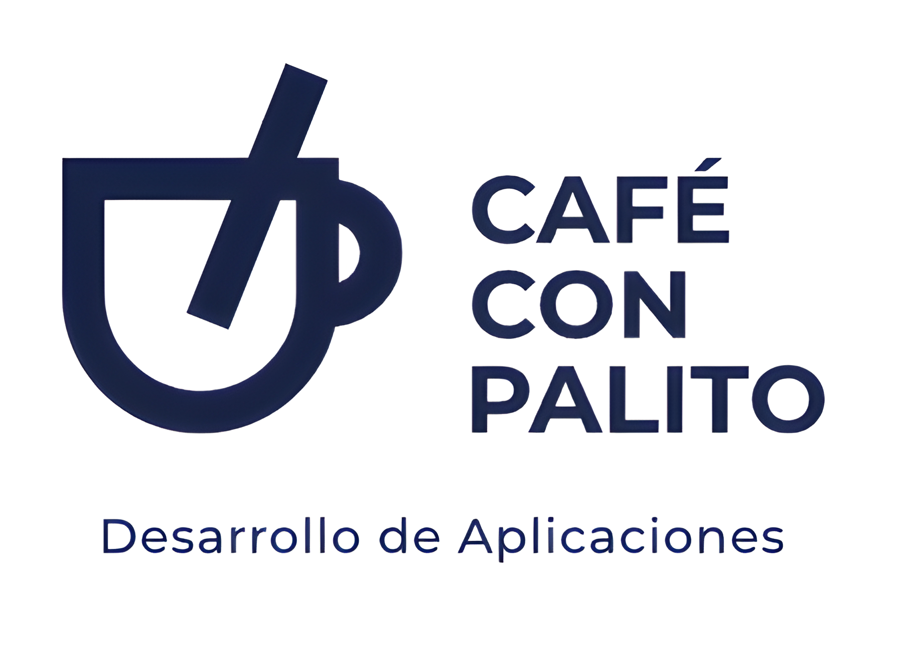

 
 

# Juego 3D para Reto Diciembre 2023 (2ºCurso)
Repositorio para hacer control del proyecto VAX Games para el Reto de Diciembre del 2º Curso del Ciclo de DAM (Desarrollo de Aplicaciones Multiplataforma)
## Integrantes
* [Albano Díez de Paulino](https://github.com/TerciodeMarte) - Albano Díez de Paulino
* [Carmen Barrios Fernández](https://github.com/CarmenBarrios) - Carmen Barrios Fernández
* [Daniel Espinosa García](https://github.com/Daniel-Espinosa) - Daniel Espinosa García
* [Ramiro Gutiérrez Valverde](https://github.com/ramirogvalverde) - Ramiro Gutiérrez Valverde

## Licencia 📄

Este proyecto está bajo la Licencia (GNU V3) - mira el archivo [LICENSE](LICENSE) para detalles

## Expresiones de Gratitud 🎁

* Comenta a otros sobre este proyecto 📢
* Invita una cerveza 🍺 o un café ☕ a los integrantes.
* Da las gracias públicamente 🤓.